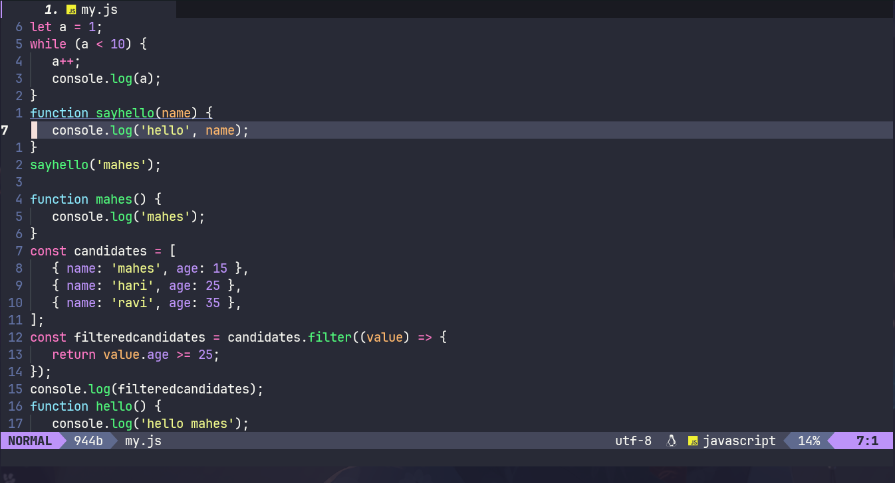
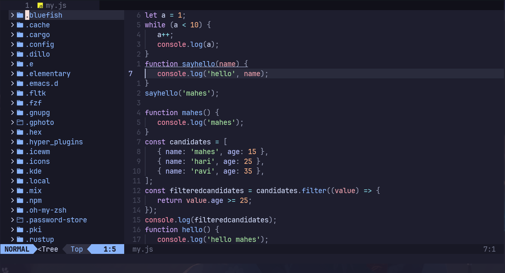
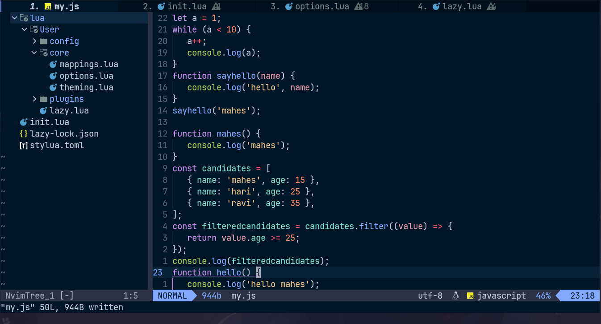
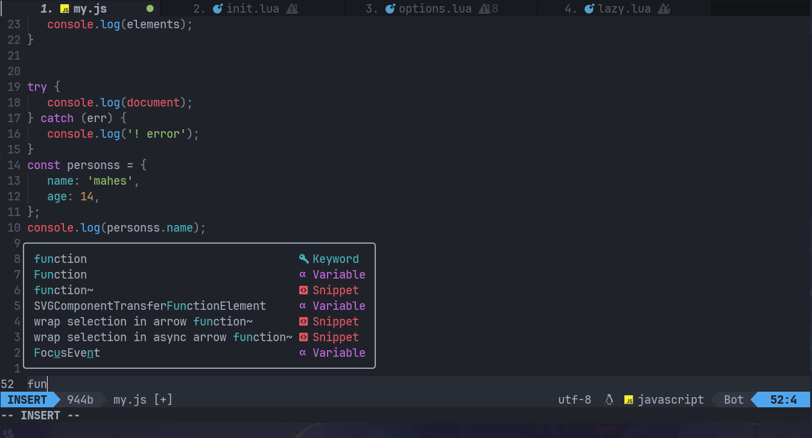
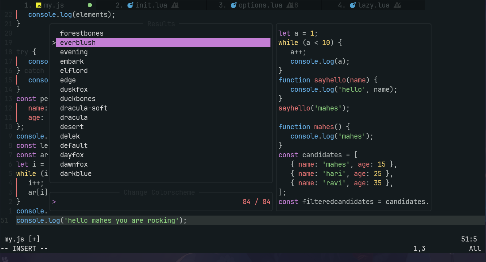

<h1>NeoChad</h1>

NeoChad is an base ide like configuration for NeoVim

<h2>
   Showcase
   <h2>
      

         <h2></h2>
         
         

         
         

         
         

         
         

         

   </h2>
   <h2>Features</h2>
   
* Lightweight but powerfull

   
*Easy configure as every config file has comments

   
* Easy to setup Lsp for new language

   
* Supports lowend devices

   
* Easy to add or delete plugins

   
* Fast startup time

   
* Plugins are loaded only when needed

   
* Awesome preinstalled themes

</h2>
<h2>Installation</h2>
